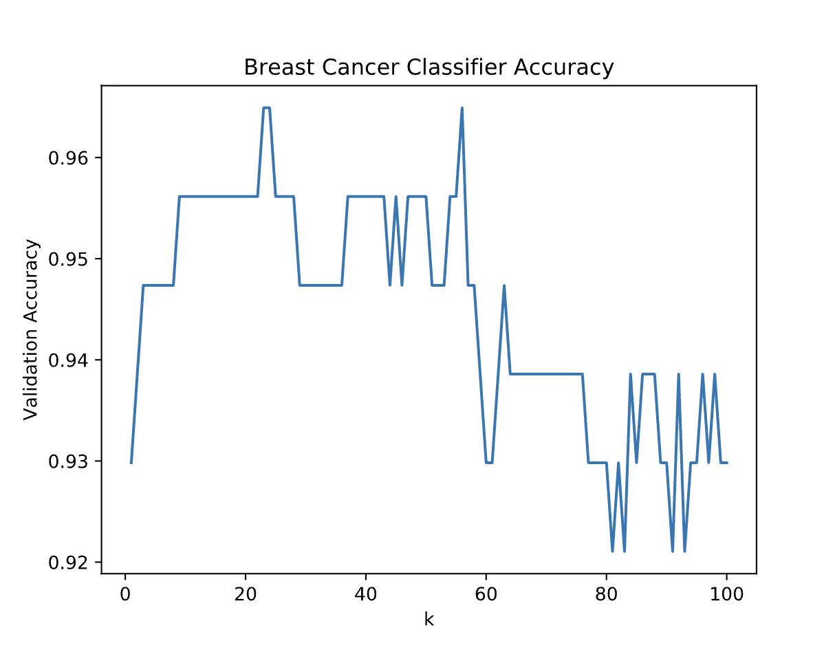

# Breast Cancer Classifier

## Descriere

Acest proiect implementează un classifier pentru cancerul de sân folosind algoritmul **K-Nearest Neighbors (KNN)** din machine learning. Scopul este de a identifica valoarea optimă a hiperparametrului `k` care maximizează acuratețea clasificării între tumori maligne și benigne.

## Tehnologie

- **Limba**: Python
- **Biblioteci utilizate**:
  - `sklearn` (scikit-learn) pentru dataset-ul cancerului de sân și algoritmii ML
  - `matplotlib` pentru vizualizare
  - `codecademylib3_seaborn` pentru styling-ul graficelor

## Ce face script-ul?

1. **Încarcă datele**: Folosește dataset-ul pre-construit `load_breast_cancer()` din scikit-learn, care conține caracteristici despre tumori (benigne sau maligne).

2. **Împarte datele**: Împarte setul de date în:
   - **Set de antrenare (80%)**: Pentru a antrena modelul
   - **Set de validare (20%)**: Pentru a testa performanța

3. **Testează diferite valori k**: Rulează KNN cu valori de `k` de la 1 la 100 și calculează acuratețea pentru fiecare.

4. **Creează vizualizarea**: Generează un grafic care arată relația dintre valoarea `k` și acuratețea de validare.

5. **Afișează rezultatele**: Graficul este salvat și afișat pentru a identifica valoarea optimă a lui `k`.

## Imaginea de exemplu



Graficul arată cum acuratețea modelului variază în funcție de valoarea `k`. În general, valori mici de `k` pot provoca overfitting, în timp ce valori prea mari pot duce la underfitting. Cea mai bună valoare este aceea care maximizează acuratețea pe setul de validare.

## Cum să rulezi

```bash
python script.py
```

Script-ul va genera automat graficul și îl va afișa.

## Algoritmul KNN

K-Nearest Neighbors este un algoritm de clasificare simplu care:
- Calculează distanța dintre un punct de date nou și toate punctele din setul de antrenare
- Selectează cele `k` cele mai apropiate vecini
- Clasifică noul punct bazându-se pe majoritatea voturilor celor `k` vecini

## Rezultate

Prin testarea mai multor valori de `k`, putem identifica configurația care oferă cea mai bună performanță pentru acest set de date specific.
